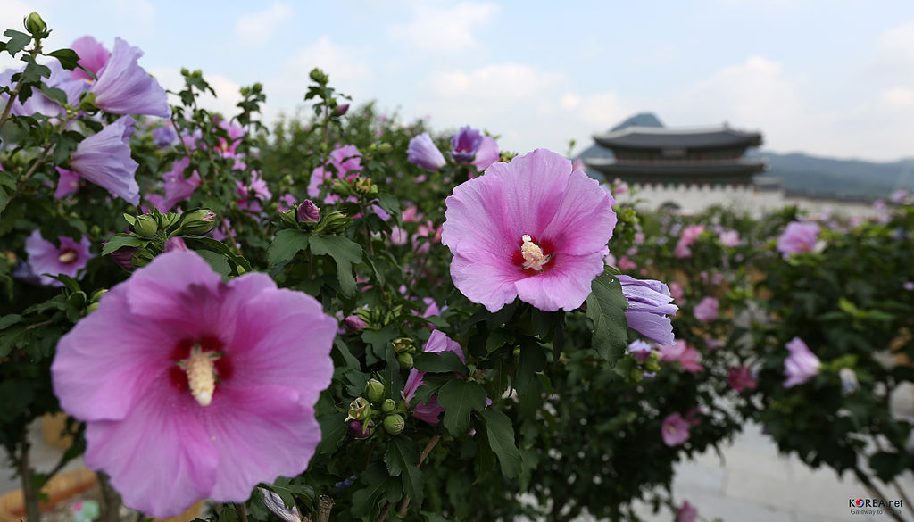

# RE Artifact Panel

### A track at [RE2019](http://re19.ajou.ac.kr), September 27,2019.

_____

### Program

Friday, Sept 27
11:00 - 12:30, Room TBD

* 11:00 - 11:06: **Andreas Vogelsang** - Introduction 
* 11:07 - 11:13: ** Tim Rietz **
* 11:14 - 11:20: ** Alessio Ferrari **
<!--* 11:21 - 11:27: 
* 11:28 - 11:34: 
* 11:35 - 11:41: 
* 11:42 - 11:48:
* 11:49 - 11:55:-->
* 11:20 - 12:30: Fishbowl Panel
_____

## Aim

The aim of the ROSE Festival is to create a celebration of open science in Software Engineering. This is a venue where researchers can come together to discuss issues in availability, replication, and reproduction of research data and research results, and where researchers can receive public credit for facilitating and participating in open science.

## Motivation

It can take months to years before a SE result is understood, repeated, extended, or perhaps even refuted. Yet, SE research venues focus on new results rather than revisiting old results. This limits the kinds of work that appear at those venues. For example, consider the research maturity levels listed below. “Functional, reusable, and available” can be assessed at the time of initial publication. However, “replicated and reproduced” may not become apparent until months or years after the initial publication.

<table>
<thead></thead>
<tbody(s)>
<tr><td><strong>Functional</strong>	</td><td align="center"> <strong>Reusable</strong> </td><td align="center"> <strong>Available</strong></td><td align="center"> <strong>Replicated</strong> </td><td align="center"> <strong>Reproduced</strong> </td></tr>
<tr><td>No Badge </td><td align="center"> <dl></dl>  </td><td align="center"> <dl></dl>	   </td><td align="center">  <dl></dl> </td><td align="center">  <dl></dl> </td></tr>
<tr><td> <!--Functional--> Artifacts documented, consistent, complete, exercisable, and include appropriate evidence of verification and validation </td><td align="center"> <!--Reusable--> Functional + very carefully documented and well-structured to the extent that reuse and repurposing is facilitated. In particular, norms and standards of the research community for artifacts of this type are strictly adhered to. </td><td align="center"> <!--Available-->  Functional + placed on a publicly accessible archival repository. A DOI or link to this repository along with a unique identifier for the object is provided. </td><td align="center"> <!--Replicated--> Available + main results of the paper have been obtained in a subsequent study by a person or team other than the authors, using, in part, artifacts provided by the author. </td><td align="center"> <!--Reproduced--> Available + the main results of the paper have been independently obtained in a subsequent study by a person or team other than the authors, without the use of author-supplied artifacts.</td></tr>
</tbody>
</table>

## METHOD

We propose 90 minute conference sessions of the following form. 

- Part1a: “Lightning talks” to report replicated or reproduced results (or negative results where replication and/or reproduction failed).
- Part1b: Invited talks on open science methods, successes (and failures)
- Part1c: A fish-bowl panel  (defined later in this page) where participants discuss factors that help, or hurt, open science in SE. 
- Part2: After each ROSE session, a set of “ROSE notes on open science in SE” will be updated with notes on the open science practices in papers from the host conference and journals (e.g., TSE, TOSEM, EMSE).  These notes will include videos from Part1.
- Part3:  At regular intervals (i.e., once every 2 years) we will run a journal special issue at a venue TBD on open science. This will be an open call to all authors (not just ROSE participants). Submissions will be invited on all aspects of open science including tips, traps, guidelines, case studies (some of which might come from ROSE presentations). Submissions should be full papers and original work.

Note that:
- Part1 could be run as part of a lunchtime session or, with a little wine, be a great way to have some fun at an evening mixer.  
- Part1 will be recorded and those videos will be freely available.
- During Part1, we will run a chat stream so participants and audience can make extended comments.   
- ROSE is primarily a way to get larger parts of the community to see, and perhaps use, an open science mindset by showcasing studies that have benefited from Open Science (and by discussing/presenting methodological issues around open science, reproduction and replication).  As such, ROSE is more an “accelerator” or “festival” event than a standard technical track in a conference.

## RESULTS

1. A fun, lively and high energy session in a conference.
2. Ways to record a growing number of reproduced /replicated results.
3. A prominent message to SE researchers that “replicated/ reproduced” results are desired and prized in this community.

## CALL FOR PRESENTATIONS

- [Call for Presentations](cfp.md)

## THE "FISH-BOWL PANEL"

 
 
 From [Wikipedia](http://en.wikipedia.org/wiki/Fishbowl_(conversation)):

- Four to five chairs are arranged in an inner circle. This is the fishbowl. 
- The remaining chairs are arranged in concentric circles outside the fishbowl.
- A few participants are selected to fill the fishbowl, while the rest of the group sits on the chairs outside the fishbowl. 
- In an open fishbowl, one chair is left empty. 
- The moderator introduces the topic and the participants start discussing the topic.
- The audience outside the fishbowl listens in on the discussion. 
- In an open fishbowl, any member of the audience can, at any time, occupy the empty chair and join the fishbowl. When this happens, an existing member of the fish-bowl must voluntarily leave the fishbowl and free a chair. 
- The discussion continues with participants frequently entering and leaving the fishbowl.  

## ORGANIZATION

- Chair:
     - Andreas Vogelsang, 
- ROSE Steering Committee:
     - Robert Feldt,	Chalmers | University of Gothenburg, Sweden
     - Tim Menzies, NC State University, USA
     - Thomas	Zimmermann,	Microsoft Research, USA
- Panel Organizers:
     - Neil	Ernst,	University of Victoria, Canada
 
