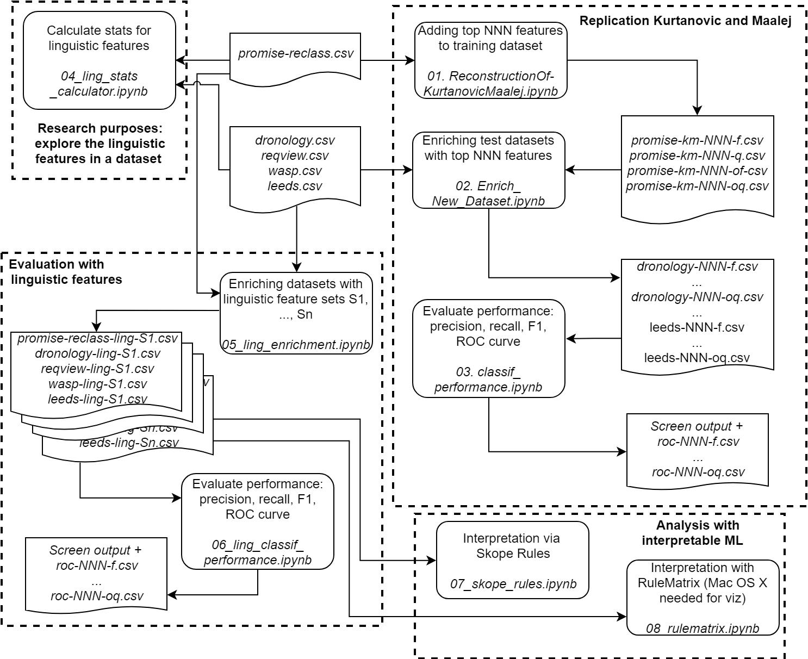

This repository includes the supplementary material for our RE 2019 submisson titled as "Requirements Classification with Interpretable Machine Learning and Dependency Parsing"

- All notebooks we have used to extract feature values and analyze data as well as a reconstruction of the state-of-the-art classifier is provided in the Notebooks folder. Each notebook includes its own detailed explaination of the tasks it executes.
  1. ReconstructionOf-KurtanovicMaalej.ipynb is the reconstruction of the classifier used by Kurtanovic and Maalej (2017)
  2. Enrich_New_Dataset.ipynb calculates the n-grams based features for the datasets used in the paper.
  3. classif_performance.ipynb classifies the requirements and reports the classification performance on the datasets.
  4. ling_stats_calculator.ipynb calculates the values of dependency parsing based linguistic features for the datasets.
  5. ling_enrichment.ipynb calculates additional linguistic features based on the dependency trees of the requirements.
  6. ling_classif_performance.ipynb classifies the requirements and reports the classification performance using the additional features extracted in the previous notebook.
  7. skope_rules.ipynb extracts logic rules that cover the classification using the skoperules library.
  8. rulematrix.ipynb extracts logic rules that cover the classification results using the RuleMatrix library.

The figure below describes the flow of how datasets and the notebooks are used for the paper.

- All datasets are provided in the "Manually tagged datasets" folder. We have removed the requirements text from those with sensitive data. Below we list how specific files are mentioned in the paper:
   * 8combined.csv: Combination of all 8 datasets listed in the paper
   * Dronology.csv: Dronology dataset
   * ds2.csv: Helpdesk dataset
   * ds3.csv: User mgmt dataset
   * INDcombined.csv: Combination of seven industrial datasets
   * leeds.csv: Leeds library dataset
   * promise-reclass.csv: PROMISE dataset
   * reqview.csv: ReqView dataset
   * wasp.csv: WASP dataset
 
- Data with various feature sets are provided in "Datasets with features". We cannot mention all different feature sets in the paper due to space limitations but provide them here for the interested readers. The identifier of the features are provided as the column headers. Below we present the mapping between the file names and feature sets in the paper:
   * Filename contains 'sd' only includes feature set FS1
   * Filename contains 'sdsb8' includes feature set FS2
   * Filename contains 'allext' includes feature set FS3
 
- Plots and tables we could not put in the paper due to space limitations are provided in "Plots and Tables" folder. 

